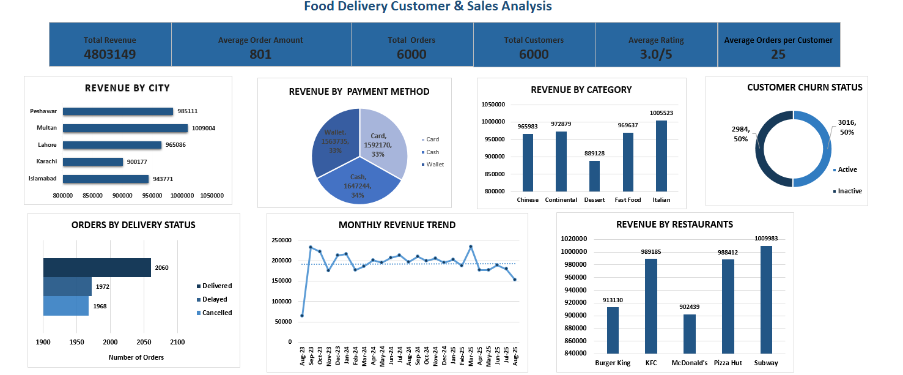

# 🍔 Food Delivery Customer & Sales Analysis using Microsoft Excel

## Project Overview

This project presents an end-to-end customer and sales analysis using the **Foodpanda Analysis Dataset** obtained from Kaggle. The objective was to analyze customer purchasing behavior, sales performance, payment preferences, customer retention, delivery operations, and restaurant performance through Microsoft Excel dashboard.

Microsoft Excel was used for data cleaning, validation, Pivot Table analysis, KPI calculations, and dashboard development using Pivot Charts, KPI cards, and column creation.

---

## Dashboard Preview



*IMicrosoft Excel dashboard displaying key customer and sales performance metrics.*

---

## Business Objectives

This analysis was conducted to answer the following business questions:

* What is the company's total revenue?
* What is the average order amount?
* Which city generates the highest revenue?
* Which restaurant contributes the most revenue?
* Which food category performs best?
* Which payment methods are preferred by customers?
* What is the current customer churn status?
* How efficient are delivery operations?
* How does revenue change over time?
* What business strategies can improve customer retention and sales?

---

## Tools Used

* Microsoft Excel
* Microsoft Word

---

## Dataset

This project uses the **Foodpanda Analysis Dataset**.

**Dataset Information**

* **Source:** Kaggle
* **Total Records:** 6,000
* **Industry:** Food Delivery

The dataset contains the following fields:

* customer_id
* gender
* age
* city
* signup_date
* order_id
* order_date
* restaurant_name
* dish_name
* category
* quantity
* price
* payment_method
* order_frequency
* last_order_date
* loyalty_points
* churned
* rating
* rating_date
* delivery_status

**Dataset Link**

https://www.kaggle.com/datasets/nabihazahid/foodpanda-analysis-dataset-2025

---

## Data Cleaning & Preparation

Before conducting the analysis, the dataset was validated and prepared using Microsoft Excel.

The preparation process included:

* Checking for duplicate records using **Remove Duplicates**.
* Checking for missing values using **Go To Special → Blanks**.
* Verifying data consistency and formatting.
* Creating an **order_month_year** column for monthly trend analysis.
* Building multiple Pivot Tables to support dashboard visualizations.

---

## Dashboard Features

The Excel dashboard contains:

* KPI Cards

  * Total Revenue
  * Average Order Amount
  * Total Orders
  * Total Customers
  * Average Rating
  * Average Orders per Customer

* Revenue by City

* Revenue by Category

* Revenue by Restaurant

* Revenue by Payment Method

* Customer Churn Status

* Orders by Delivery Status

* Monthly Revenue Trend


---

## Key Findings

| Metric                      |    Result |
|-----------------------------|-----------|
| Total Revenue               | 4,803,149 |
| Average Order Amount        |       801 |
| Total Orders                |     6,000 |
| Total Customers             |     6,000 |
| Average Rating              |       3.0 |
| Average Orders per Customer |        25 |
| Highest Revenue City        |    Multan |
| Highest Revenue Category    |   Italian |
| Highest Revenue Restaurant  |    Subway |
-------------------------------------------

----

## Business Insights

* Multan generated the highest overall revenue.
* Italian cuisine was the highest-performing food category.
* Subway generated the highest restaurant revenue.
* Revenue from Cash, Card, and Wallet payments was almost evenly distributed.
* Active and inactive customers were nearly equal in number, highlighting opportunities to improve customer retention.
* Delivered, delayed, and cancelled orders occurred in almost equal proportions.
* Revenue remained relatively stable throughout the analysis period, with the highest revenue recorded in March 2025.

---

## Strategic Recommendations

* Introduce welcome offers for newly registered customers to encourage early purchases.
* Reward loyal customers with exclusive discounts and free delivery.
* Offer threshold-based discounts to increase the average order value.
* Promote high-performing food categories through targeted marketing campaigns.
* Increase promotional efforts in lower-performing cities.
* Record **Delay Reason** and **Cancellation Reason** to improve operational analysis.
* Monitor restaurant performance using customer ratings and feedback.
* Introduce promotional campaigns across different payment methods.

---

## Repository Structure

```text
food-delivery-customer-and-sales-analysis
│
├── Data
│   └── Foodpanda_Analysis_Dataset.xlsx
│
├── Excel
│   └── Food_Delivery_Customer_and_Sales_Analysis.xlsx
│
├── Report
│   └── Food_Delivery_Customer_and_Sales_Analysis_Report.pdf
│
├── Images
│   └── dashboard.png
│   └── data_preparation.png
│   └── dataset
│   └── pivot_tables
│ 
├── README.md
└── LICENSE
```

---

## Skills Demonstrated

* Data Cleaning
* Data Validation
* Pivot Tables
* Pivot Charts
* KPI Development
* Dashboard Design
* Data Visualization
* Business Analysis
* Microsoft Excel

---

## Author

**Raisa Akter**

B.Sc. in Computer Science & Engineering

Aspiring Data Analyst
